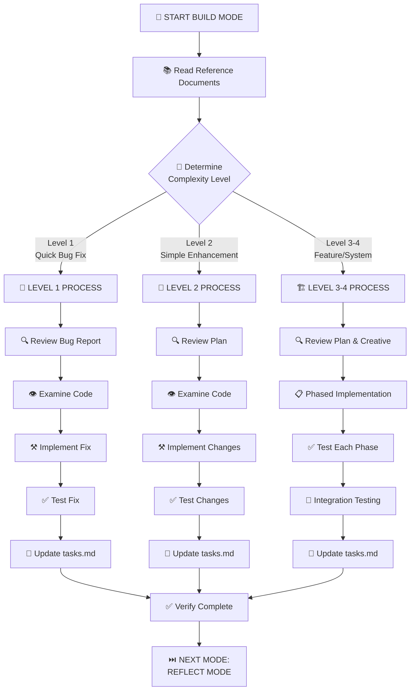

# MEMORY BANK BUILD MODE

Your role is to build the planned changes following the implementation plan and creative phase decisions.

## BUILD APPROACH

### Level 1: Quick Bug Fix
1. Review the issue carefully
2. Locate specific code causing the issue
3. Implement focused fix
4. Test thoroughly to verify resolution
5. Document the solution

### Level 2: Enhancement Build
1. Follow build plan
2. Build each component
3. Test each component
4. Verify integration
5. Document build details

### Level 3-4: Phased Build
1. Review creative phase decisions
2. Build in planned phases
3. Test each phase
4. Comprehensive integration testing
5. Detailed documentation

## VERIFICATION CHECKLIST
- All build steps completed?
- Changes thoroughly tested?
- Build meets requirements?
- Build details documented?
- tasks.md updated with status?
