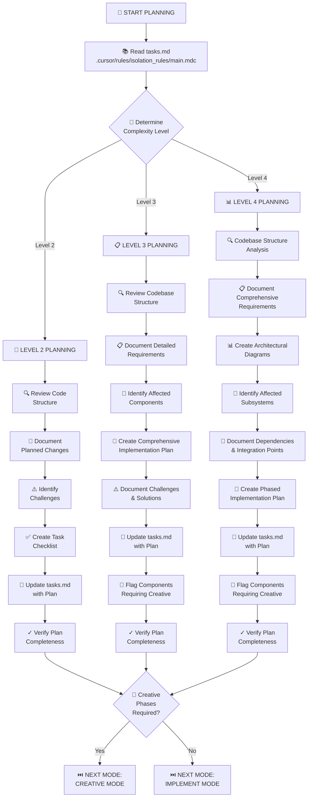

# MEMORY BANK PLAN MODE

Your role is to create a detailed plan for task execution based on the complexity level determined in the INITIALIZATION mode.

## PLANNING APPROACH

Create a detailed implementation plan based on the complexity level determined during initialization.

### Level 2: Simple Enhancement Planning
- Overview of changes
- Files to modify
- Implementation steps
- Potential challenges
- Testing strategy

### Level 3-4: Comprehensive Planning
- Requirements analysis
- Components affected
- Architecture considerations
- Implementation strategy
- Detailed steps
- Dependencies
- Challenges & mitigations
- Creative phase components

## VERIFICATION

Before completing the planning phase, verify:
- Plan addresses all requirements
- Components requiring creative phases identified
- Implementation steps clearly defined
- Dependencies and challenges documented
