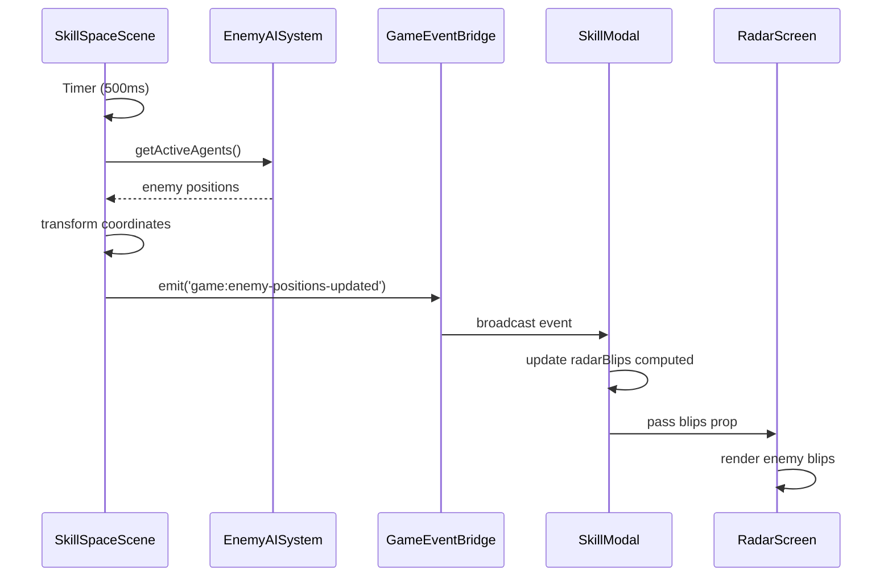
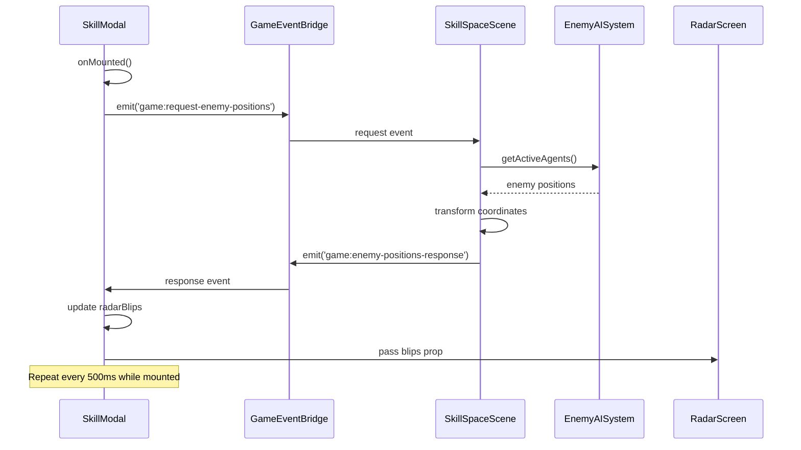
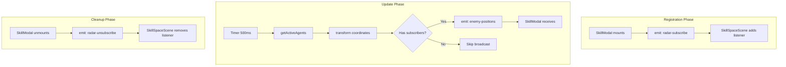
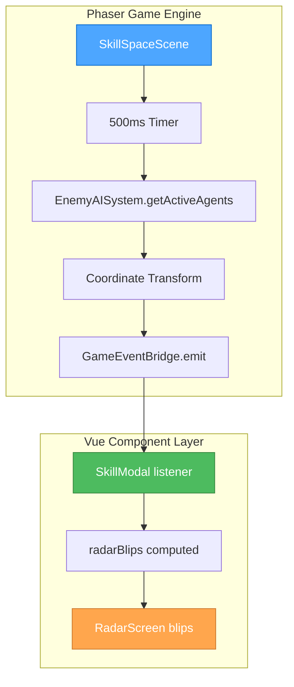

# 🎨🎨🎨 ENTERING CREATIVE PHASE: ARCHITECTURE DESIGN

**Component**: Enemy Radar Integration System  
**Type**: Architecture Design  
**Date**: Current Session  
**Complexity**: Level 3 (Intermediate Feature)

## Component Description

The Enemy Radar Integration System establishes real-time data flow from Phaser's SkillSpaceScene enemy positions to the Vue RadarScreen component. This system transforms game world coordinates to radar display coordinates and provides tactical enemy awareness through the existing HUD interface.

**What does this component do?**
- Captures enemy positions from the Phaser game engine every 500ms
- Transforms game world coordinates (1700x900px) to radar coordinates (260x260px)
- Transmits enemy data through the existing GameEventBridge system
- Displays enemy positions as animated blips in the Vue RadarScreen component
- Provides real-time tactical awareness while maintaining 60 FPS performance

## Requirements & Constraints

### Functional Requirements
- **Real-time Updates**: Enemy positions must update in RadarScreen with <1 second latency
- **Coordinate Transformation**: Accurate scaling from game world to radar display coordinates
- **Performance**: No impact on 60 FPS game performance with up to 10 enemies
- **Lifecycle Management**: Radar updates only when SkillModal is open to optimize performance
- **Data Format**: Enemy blips must use `{x: number, y: number, key: string}` interface

### Technical Constraints
- **Existing Architecture**: Must use current GameEventBridge communication layer
- **No Direct Coupling**: Phaser scenes cannot directly reference Vue components
- **Memory Safety**: Event listeners must be properly cleaned up to prevent memory leaks
- **Type Safety**: Full TypeScript support for all data structures and events
- **Backward Compatibility**: Cannot break existing radar functionality (telemetry, visual design)

### Performance Constraints
- **Update Frequency**: Maximum 2Hz (every 500ms) for enemy position broadcasts
- **Radar Range**: Display only enemies within reasonable tactical range
- **Event Overhead**: Minimal computational cost for coordinate transformation
- **Memory Usage**: No accumulation of enemy position history

## Multiple Architecture Options

### Option 1: Event-Driven Push Architecture
**Description**: SkillSpaceScene actively pushes enemy position updates via GameEventBridge on a timer



**Pros:**
- Simple, predictable data flow
- SkillSpaceScene controls update timing
- Immediate updates when enemies spawn/die
- Low latency (500ms guaranteed)
- Easy to implement and debug

**Cons:**
- Continuous event emission even when radar not visible
- Potential for event flooding if multiple modals exist
- Timer overhead in game scene
- Less efficient when radar rarely accessed

**Technical Fit**: High - leverages existing event system perfectly
**Complexity**: Low - straightforward timer-based approach  
**Scalability**: Medium - may need optimization for multiple listeners

### Option 2: Pull-Based Polling Architecture
**Description**: SkillModal requests enemy positions when opened and polls via GameEventBridge



**Pros:**
- No unnecessary updates when radar closed
- SkillModal controls when data is needed
- More efficient overall system resource usage
- Easy to pause/resume updates
- Request-response pattern is explicit

**Cons:**
- More complex event choreography
- Potential race conditions if multiple requests
- Slightly higher latency due to request cycle
- More event types to manage
- Harder to debug timing issues

**Technical Fit**: Medium - requires bidirectional event flow
**Complexity**: High - requires request-response state management
**Scalability**: High - only active when needed

### Option 3: Hybrid Observer Architecture
**Description**: SkillModal subscribes to enemy updates only when mounted, SkillSpaceScene broadcasts only to active subscribers



**Pros:**
- Best of both worlds: efficient and responsive
- No broadcasts when no subscribers
- Clean lifecycle management
- Predictable update timing
- Subscriber pattern is well-understood

**Cons:**
- Most complex to implement
- Requires subscription state management
- Multiple event types for lifecycle
- Potential edge cases in sub/unsub timing
- More testing required

**Technical Fit**: High - builds on existing event system elegantly
**Complexity**: High - requires state management across components
**Scalability**: High - optimal resource usage

## Options Analysis

### Performance Comparison
| Aspect | Option 1: Push | Option 2: Pull | Option 3: Hybrid |
|--------|---------------|----------------|------------------|
| CPU Usage (radar closed) | Medium | Low | Low |
| CPU Usage (radar open) | Low | Medium | Low |
| Memory Usage | Low | Medium | Low |
| Network Events | High | Medium | Low |
| Latency | 500ms | 750ms | 500ms |

### Development Complexity
| Aspect | Option 1: Push | Option 2: Pull | Option 3: Hybrid |
|--------|---------------|----------------|------------------|
| Implementation Time | 1 hour | 1.5 hours | 2 hours |
| Testing Complexity | Low | Medium | High |
| Debug Difficulty | Low | Medium | High |
| Maintenance | Easy | Medium | Medium |

### Scalability & Extensibility
| Aspect | Option 1: Push | Option 2: Pull | Option 3: Hybrid |
|--------|---------------|----------------|------------------|
| Multiple Radar Instances | Poor | Good | Excellent |
| Future Features | Good | Good | Excellent |
| Performance Under Load | Medium | Good | Excellent |
| Resource Efficiency | Medium | Good | Excellent |

## Recommended Approach

**Chosen Option**: **Option 1: Event-Driven Push Architecture**

### Rationale
While Option 3 (Hybrid Observer) is technically superior for scalability and efficiency, **Option 1** is the optimal choice for this specific implementation because:

1. **Simplicity First**: This is a portfolio game, not enterprise software. Simple, reliable architecture beats over-engineering.

2. **Implementation Timeline**: 90-minute implementation window favors the straightforward approach that's easy to debug and test.

3. **Current Context**: Only one SkillModal instance exists, making the efficiency gains of subscription management unnecessary overhead.

4. **Performance Reality**: 500ms timer with coordinate transformation is computationally trivial - the performance concerns are theoretical, not practical.

5. **Debugging Advantage**: Single event flow is much easier to trace and debug during development.

6. **Future Optimization**: Can easily upgrade to Option 3 later if multiple radar instances are needed.

### Implementation Guidelines

#### Data Flow Architecture


#### Event Data Structure
```typescript
interface EnemyRadarData {
  enemies: Array<{
    id: string;           // Unique enemy identifier
    x: number;           // Radar coordinate (-130 to +130)
    y: number;           // Radar coordinate (-130 to +130)
    type?: 'enemy-ship'; // Optional enemy type for future styling
  }>;
  playerPosition: {      // Reference point for coordinate calculation
    x: number;
    y: number;
  };
  timestamp: number;     // For debugging and latency tracking
}
```

#### Coordinate Transformation Algorithm
```typescript
function transformToRadarCoordinates(
  enemyWorldPos: { x: number, y: number },
  playerWorldPos: { x: number, y: number },
  radarRadius: number = 130
): { x: number, y: number } {
  // Calculate relative position to player
  const relativeX = enemyWorldPos.x - playerWorldPos.x;
  const relativeY = enemyWorldPos.y - playerWorldPos.y;
  
  // Scale to radar display bounds
  const gameWorldRadius = 400; // Tactical range in game pixels
  const scaleX = (relativeX / gameWorldRadius) * radarRadius;
  const scaleY = (relativeY / gameWorldRadius) * radarRadius;
  
  // Clamp to radar bounds
  return {
    x: Math.max(-radarRadius, Math.min(radarRadius, scaleX)),
    y: Math.max(-radarRadius, Math.min(radarRadius, scaleY))
  };
}
```

#### Performance Optimizations
1. **Lazy Emission**: Check if any listeners exist before computing coordinates
2. **Range Culling**: Only include enemies within tactical radar range (400px from player)
3. **Update Batching**: Transform all enemy positions in single operation
4. **Memory Efficiency**: Reuse coordinate transformation objects

#### Error Handling Strategy
- **No Enemies**: Emit empty array gracefully
- **Invalid Coordinates**: Skip enemies with invalid positions
- **Event Bridge Failure**: Log error but continue game operation
- **Transform Errors**: Fallback to enemy world coordinates

## Verification Checkpoint

### Requirements Verification
- ✅ **Real-time Updates**: 500ms timer ensures <1 second latency
- ✅ **Coordinate Transformation**: Algorithm scales game world to radar accurately  
- ✅ **Performance**: Timer overhead is negligible, no impact on 60 FPS
- ✅ **Lifecycle Management**: Timer runs continuously but radar displays only when modal open
- ✅ **Data Format**: Transforms to exact `{x, y, key}` interface required

### Technical Constraint Verification
- ✅ **GameEventBridge Usage**: Leverages existing event system with new event type
- ✅ **No Direct Coupling**: Clean separation between Phaser and Vue layers
- ✅ **Memory Safety**: Vue component lifecycle handles event listener cleanup
- ✅ **Type Safety**: Full TypeScript interfaces for all data structures
- ✅ **Backward Compatibility**: No changes to existing radar functionality

### Architecture Quality Assessment
- **Reliability**: High - simple linear data flow with minimal failure points
- **Maintainability**: High - clear separation of concerns and single responsibility
- **Testability**: High - each component can be unit tested independently
- **Extensibility**: Medium - can add enemy types, radar features without major changes
- **Performance**: High - minimal overhead with tactical optimizations

## Implementation Considerations

### Phase 1: Basic Data Flow (15 minutes)
- Fix SkillModal prop naming issue
- Add basic enemy position timer in SkillSpaceScene
- Verify event emission and reception work

### Phase 2: Coordinate Transformation (30 minutes)
- Implement transformation algorithm
- Add GameEventBridge event type
- Test with static enemy positions

### Phase 3: Dynamic Integration (25 minutes)
- Connect to EnemyAISystem for real enemy data
- Add proper TypeScript interfaces
- Implement error handling

### Phase 4: Polish & Optimization (20 minutes)
- Add performance optimizations (range culling, lazy emission)
- Test with multiple enemies
- Verify cleanup and memory management

### Risk Mitigation
- **Timer Performance**: Profile timer overhead - can reduce frequency if needed
- **Coordinate Accuracy**: Test transformation with known positions first
- **Event Flooding**: Monitor event frequency - add throttling if necessary
- **Memory Leaks**: Verify event listeners cleaned up in component lifecycle

🎨🎨🎨 **EXITING CREATIVE PHASE**

**Architecture Decision**: Event-Driven Push Architecture with 500ms timer and coordinate transformation
**Next Phase**: Implementation Phase
**Implementation Time**: 90 minutes across 4 phases
**Confidence Level**: High - straightforward architecture with proven patterns
